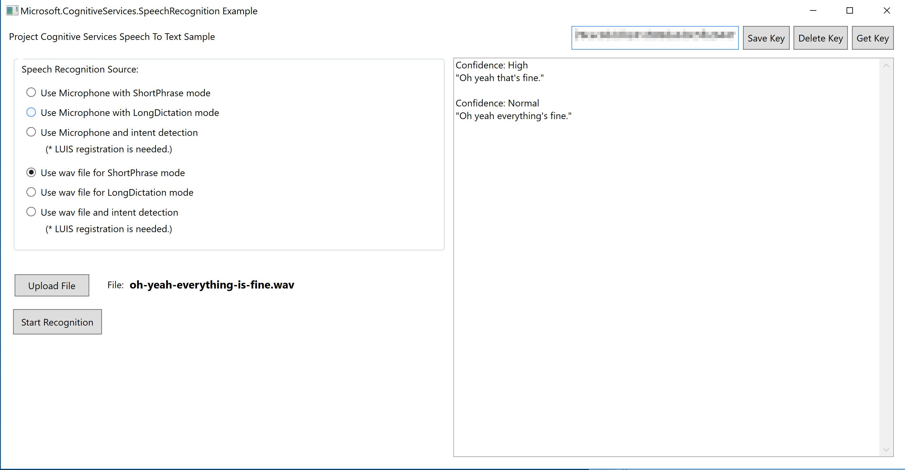

# Bing Speech API Sample (Speech-To-Text)

## Overview

This sample recognizes near real-time audio streaming and converts to text. The sample provides options to recognize audio coming from the microphone, from a different real-time audio source or from a file.

## Scenarios

Some useful business scenarios for converting audio to text:

- Call Centers: Automatically detect keywords to route conversations to appropriate personnel, notify managers of problems in real-time, and learn about other potentially harmful issues.

- Customer Support: Capture metadata (like age, gender, emotion, overall sentiment, topics of discussion and other key classifiers) to help you understand more your customers. Improve customer support processes for agents and support managers by capturing and tracking voice from your support conversations.

## Speech Recognition

This sample is an adaptation of the [Windows Speech-to-Text](https://github.com/Azure-Samples/Cognitive-Speech-STT-Windows). There is an upload button where you can add a .wav file and only **Confidences** are shown as results to simplify the visualization. At the time of this writing, only .wav files are supported for the API.

Before clicking on **Start Recognition**, make sure you added and saved your Bing Search Subscription Key.



 The sample is configured to recognize English (en-US) language. If you want to change it, open the **MainWindow.xaml.cs** file and update the **DefaultLocale** property.

 ```cs
/// <summary>
/// Gets the default locale.
/// </summary>
/// <value>
/// The default locale.
/// </value>
private static string DefaultLocale => "en-US";
 ```

## References

- [Microsoft Bing Speech API: Windows Speech-to-Text Sample](https://azure.microsoft.com/en-us/resources/samples/cognitive-speech-stt-windows/)
- [Bing Speech API overview](https://docs.microsoft.com/en-us/azure/cognitive-services/speech/home) 