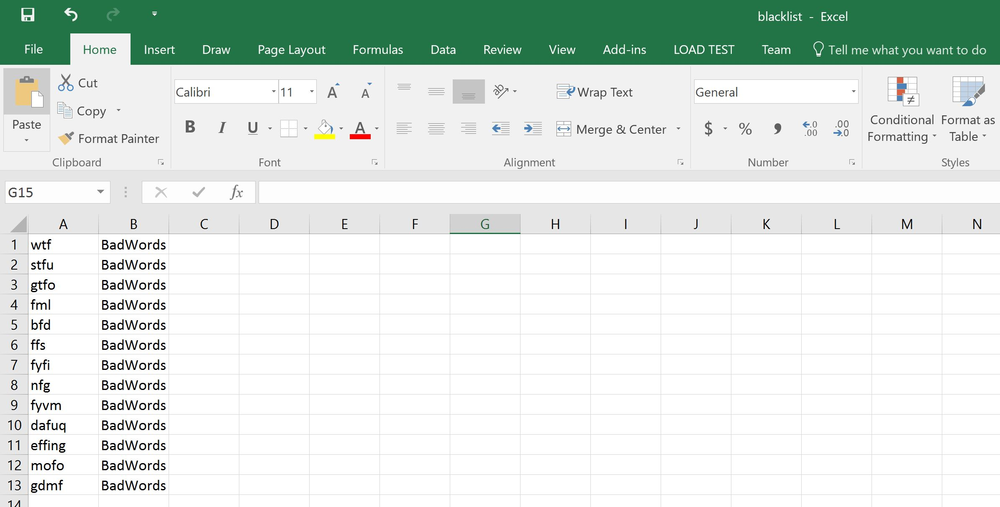
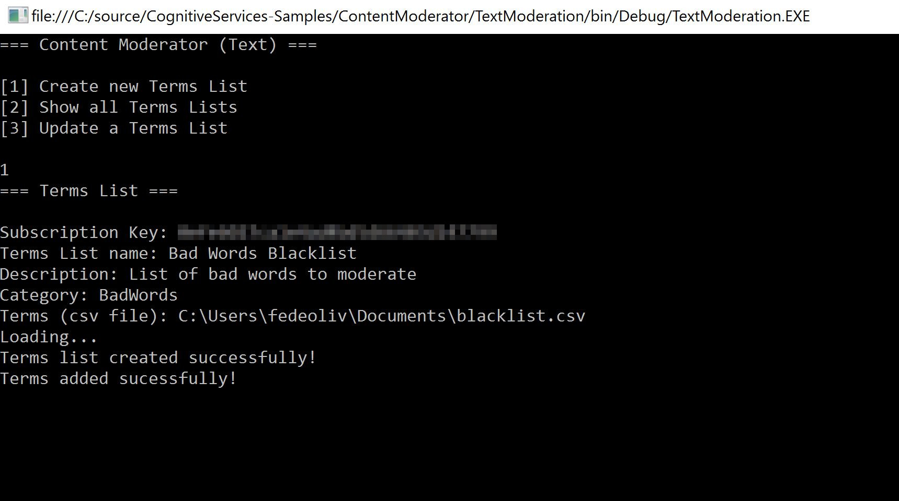
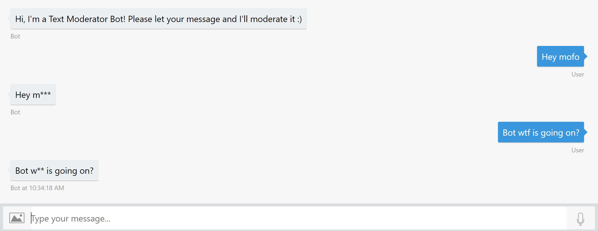
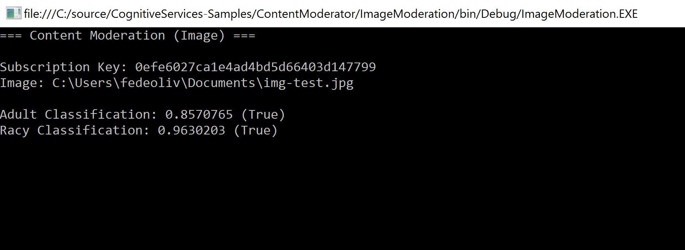

# Content Moderator API Sample

## Overview

This is a sample that implements the [Content Moderator API](https://azure.microsoft.com/en-us/services/cognitive-services/content-moderator/) to track and filter out offensive and unwanted content that creates risks for businesses. It is divided in two Console applications (**Text Moderation** and **Image Moderation**) and an **Echo Bot** that returns the text moderated.

## Scenarios

Some useful scenarios for moderating content:

- **Text moderation** benefits communities, family-based web sites, in-game communities, chat and messaging platforms, and user-generated content marketing.

- **Image moderation** works great for ensuring profile pictures, social media, and business documents are appropriate. Using it on image sharing sites saves resources by providing a first-level scan and flagging potentially damaging content.

## Text Moderation

If you want to create a custom blacklist for terms you want to moderate, you have to follow these three steps:

- [Create a Terms List](https://westus.dev.cognitive.microsoft.com/docs/services/57cf755e3f9b070c105bd2c2/operations/57cf755e3f9b070868a1f67f)
- [Add terms to a Terms List](https://westus.dev.cognitive.microsoft.com/docs/services/57cf755e3f9b070c105bd2c2/operations/57cf755e3f9b070868a1f67b)
- [Refresh Search Index](https://westus.dev.cognitive.microsoft.com/docs/services/57cf755e3f9b070c105bd2c2/operations/57cf755e3f9b070868a1f684)

The Content Moderation API has some terms moderated by default. When you refresh the search index, you add your terms list to the search range used by the API. The sample offers three options: create, show and update terms lists.

For this sample, the blacklist was created in a .csv file (you can find this file in the root folder). It contains the term to be moderated and the category name (optional). It's not mandatory to create your terms in a .csv file, it was just a way to automate the process of adding terms (instead of adding one by one).

Run the **Text Moderation** sample and create a new Terms List. It will require your Content Moderator Subscription Key and your .csv file with terms to be added, so you just need to paste the file path.

## Bot for Text Moderation

In the **BotTextModerator** sample, open the **Web.config** file. Update the **ContentModeratorKey** value with your Content Moderator Subscription Key. Then you can run your bot using the [Bot Framework Emulator](https://github.com/Microsoft/BotFramework-Emulator).

The API returns a list of terms identified and then you can decide what to do in your application. In this bot sample, a '*' character was added in all terms.

## Image Moderation

The **ImageModeration** sample receives an image and verify if it's an **Adult content**, **Racy content** or neither of them.

## References

- [API Reference for Content Moderator](https://docs.microsoft.com/en-us/azure/cognitive-services/content-moderator/api-reference)
- [Try term lists with the Text Moderation API](https://docs.microsoft.com/en-us/azure/cognitive-services/content-moderator/try-terms-list-api)