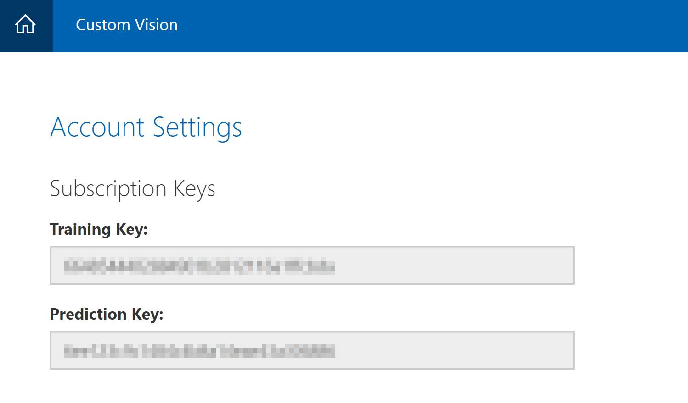
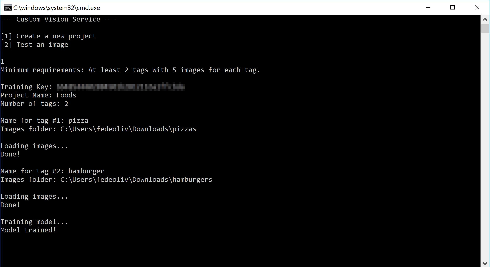
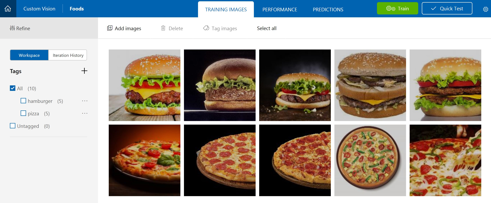
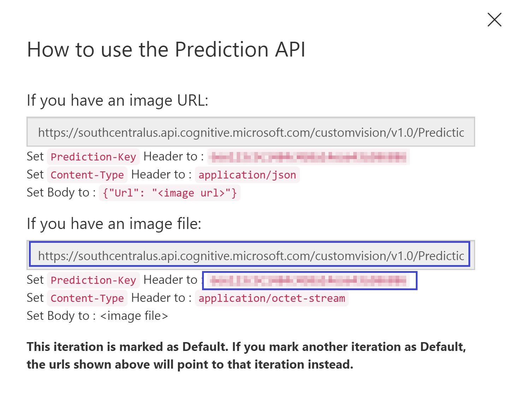
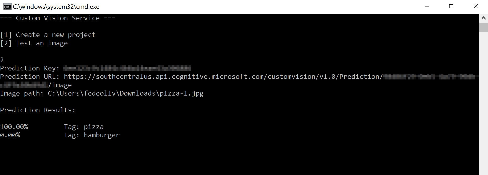

# Custom Vision API Sample

## Overview

This is a Console Application that implements the Custom Vision API to build custom image classifiers. The application provides two options: Create a new Custom Vision Project and upload an image for test (making predictions).

## Create a Custom Vision Project

The application will create a new project, add tags to it, upload images and train the project. To do this, you have to provide your **Custom Vision Training Key**.

Go to the [Custom Vision website](https://customvision.ai) and sign in. Then click on **Settings** and copy the **Training Key**. 

Run the application and select the option of creating a new project. Paste your Training Key, enter a Project Name, number of tags and your images. The sample will upload your images in batch, so paste your **folder patch** for each tag.

After uploading your images, the application will train the model according to your tags. If you go back to the [Custom Vision website](https://customvision.ai), you'll see that your project was created successfully.

## Quick Test

After training your project, you can take quick tests to see how accurate the model is to classify your image. Go to the [Custom Vision website](https://customvision.ai), select your project, click on **Performance** tab and then click on **Prediction URL**. We'll need the Prediction URL for **image files** and the **Prediction Key**.

Run the application and select the option of testing an image. Paste your Prediction Key, Prediction URL and the image path you want to test. It's important to remember the image you want to test don't have to be an image you used for training the project.

## References

- [Custom Vision Documentation](https://docs.microsoft.com/en-us/azure/cognitive-services/custom-vision-service/home)
- [Custom Vision API Reference](https://southcentralus.dev.cognitive.microsoft.com/docs/services/eb68250e4e954d9bae0c2650db79c653/operations/58acd3c1ef062f0344a42814)